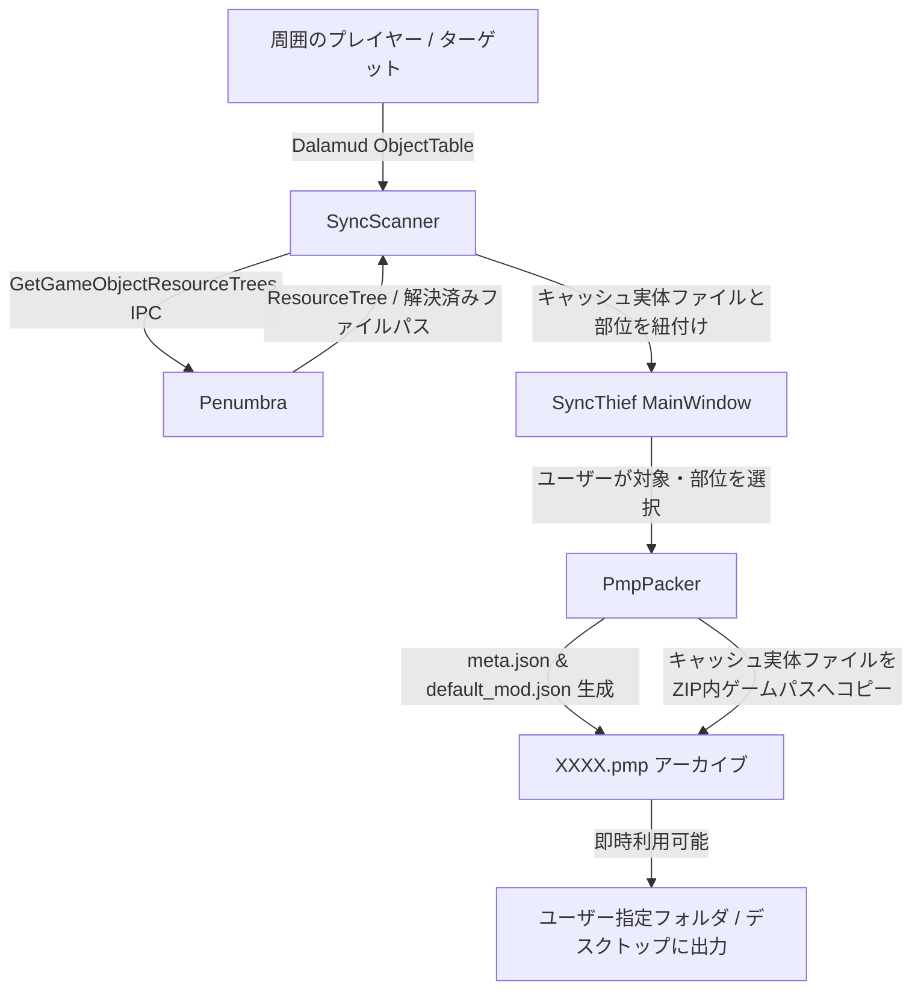

# SyncThief 実装計画書

Player Sync (MareSempiterne / Mare Synchronos) で ZoneSync（周囲同期）した際に取得される他プレイヤーの MOD ファイル（キャッシュ内に英数字ハッシュ名で格納された `.mdl`, `.tex`, `.mtrl` 等）を特定し、ユーザーが任意の対象プレイヤーおよび部位（頭、胴、髪型、武器など）を選択して、Penumbra で即座にインポート・利用可能な `.pmp`（Penumbra Mod Pack）ファイルとしてエクスポートする Dalamud プラグイン **SyncThief** を開発します。

---

## ユーザー確認事項 (User Review Required)

> [!IMPORTANT]
> **1. GitHub リポジトリと配布 URL の構成**
> - 今回の開発コードは指定された新規リポジトリ `https://github.com/runte3221/SyncThief.git` へプッシュします。
> - 指示に従い、**GitHub の説明欄（Description, README）には何も記載しない** 構成を徹底します。
> - ランチャー側の登録 URL については、以前のリポジトリ（HousingToStagehand-）側の `repo.json` にも `SyncThief` のエントリを追加反映することで、ユーザー側でランチャーのカスタムリポジトリ URL を変更・追加することなく、そのままプラグイン一覧からインストールできるように連携します。
>
> **2. エクスポート仕様とパフォーマンス対策**
> - 「全自動だと負荷が高いため、任意のものを選択できる形が望ましい」という要望に基づき、UI 上で **プレイヤー一覧** と **部位別（Head, Body, Hands, Legs, Feet, Hair, Face, Body/Skin, Weapon等）のチェックボックス** を提供します。
> - 「すべて選択」「選択解除」ボタンも完備し、1クリックで丸ごと抜くことも、特定の衣装・髪型だけを個別に抜くことも可能です。

---

## 提案する変更内容 (Proposed Changes)

### 1. プロジェクト構成と自動ビルド・配布基盤
新規ディレクトリ `C:\Users\RYO\Desktop\SyncThief` に以下を作成します。

#### [NEW] [SyncThief.csproj](file:///C:/Users/RYO/Desktop/SyncThief/SyncThief.csproj)
- Dalamud.NET.Sdk (API Level 15 / `net10.0-windows`)
- NuGet パッケージ `Penumbra.Api` (5.19.2) を直接参照

#### [NEW] [SyncThief.json](file:///C:/Users/RYO/Desktop/SyncThief/SyncThief.json)
- プラグインマニフェスト（Description は空欄）

#### [NEW] [repo.json](file:///C:/Users/RYO/Desktop/SyncThief/repo.json)
- Dalamud カスタムリポジトリ用マニフェスト（Description は空欄）

#### [NEW] [.github/workflows/build.yml](file:///C:/Users/RYO/Desktop/SyncThief/.github/workflows/build.yml)
- GitHub Actions による自動ビルド（GitHub Release への `latest.zip` アップロード）

#### [NEW] [package.json](file:///C:/Users/RYO/Desktop/SyncThief/package.json) / [CHANGELOG.md](file:///C:/Users/RYO/Desktop/SyncThief/CHANGELOG.md) / [README.md](file:///C:/Users/RYO/Desktop/SyncThief/README.md)
- バージョン管理・履歴用（README は説明なしで空）

---

### 2. コアロジック・サービス層

#### [NEW] `Ipc/PenumbraIpc.cs`
- `Penumbra.Api.IpcSubscribers.GetGameObjectResourceTrees` を使用し、指定オブジェクトのリソースツリー（モデル、マテリアル、テクスチャ、およびそれらが参照している実際のキャッシュファイルパス `F:\Player Sync Storage\XXXX.tex` 等）を安全に取得するラッパー。
- Penumbra の有効状態や `GetModDirectory` の取得。

#### [NEW] `Models/SyncModels.cs`
- `ParsedResource`: ゲーム内パス、実ファイルパス、ファイル種別、サイズ
- `SlotGroup`: 部位区分（Head, Body/Top, Hands, Legs, Feet, Hair, Face, Body, Weapon, Other）
- `PlayerSyncData`: プレイヤー名、ワールド、部位別リソースリスト

#### [NEW] `Services/ResourceScanner.cs`
- 周囲の他プレイヤー（`PlayerCharacter`）および現在ターゲットしているプレイヤーをスキャン。
- リソースツリーから、ゲーム標準ファイルではなく「キャッシュフォルダやMODフォルダ等の外部ファイルにリダイレクトされているアセット」のみを抽出。
- ゲームパス（`chara/equipment/e...`, `chara/human/c.../obj/hair/h...` 等）から自動的に部位を分類。

#### [NEW] `Services/PmpPacker.cs`
- 選択されたリソース群から Penumbra Mod Pack (`.pmp`) を生成：
  1. `meta.json`: Mod名、バージョン、作者
  2. `default_mod.json`: ゲーム内パスと内部ファイルの対応辞書
  3. 各実体ファイルをゲーム内パス構造で ZIP 圧縮
- 非同期処理（UIフリーズなし）と進捗バー表示。

---

### 3. ユーザーインターフェース (UI)

#### [NEW] `UI/MainWindow.cs`
- ImGui ウィンドウ（コマンド `/syncthief` でトグル表示）
- **プレイヤー選択セクション**:
  - 現在ターゲット中のプレイヤーを強調表示
  - 周囲のプレイヤーのドロップダウン / リスト表示
- **部位選択セクション**:
  - 部位ごとのチェックボックス（ファイル数、合計サイズ表示）
  - 「全選択」「全解除」ボタン
  - 詳細アコーディオン（含まれる `.mdl`, `.tex`, `.mtrl` を個別に確認可能）
- **エクスポート設定セクション**:
  - Mod 名入力欄（初期値: `SyncThief_{プレイヤー名}_{部位名}`）
  - 出力先フォルダ選択（初期値: デスクトップ、変更可能）
  - `[ 選択した部位を .pmp に出力 ]` ボタン
  - 出力完了メッセージ & `[ 保存先フォルダを開く ]` ボタン

#### [NEW] `Plugin.cs`
- Dalamud プラグインライフサイクル管理、コマンド登録 (`/syncthief`)

---

### 4. 既存リポジトリへの連携
- [C:\Users\RYO\Desktop\Brio to Stagehand\repo.json](file:///C:/Users/RYO/Desktop/Brio%20to%20Stagehand/repo.json) に SyncThief のエントリを追加し、既存のランチャー登録 URL からもインストール可能にします。

---

## 検証計画 (Verification Plan)

### 1. ビルド検証
- GitHub Actions 上での Windows / .NET 10 環境での完全自動ビルド。
- NuGet パッケージ `Penumbra.Api` の依存関係解決および `latest.zip` の正常生成を確認。

### 2. 機能検証
- プラグイン起動とコマンド `/syncthief` による UI 表示確認。
- 周囲のプレイヤー / ターゲットの MOD リソース取得と部位分類が正しく行われるか確認。
- 選択した部位の `.pmp` が指定フォルダに生成され、Penumbra の「MODのインポート」機能でエラーなく即座に読み込めるか確認。
